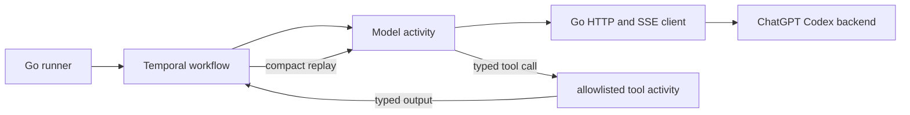

# Temporal Codex direct-call POC

This POC proves that a Go Temporal workflow can run an agent tool loop in one
local Kubernetes worker pod while calling the subscription-backed ChatGPT Codex
Responses backend directly over HTTP and server-sent events.

This is deliberately not the supported OpenAI API. It uses ChatGPT OAuth
credentials and a private backend contract inferred from pi's open-source
implementation. That contract can change without notice, so this code is an
experiment, not a production integration.

## Current POC



The workflow is deterministic. All network and tool side effects are
activities. Model results distinguish final text from tool calls, the single
tool is allowlisted and argument-validated, and the loop has a hard turn cap.
The continuation sends the original prompt, the model's function call, and the
tool output as a complete replay because the ChatGPT backend requires
`store: false`.

The deployment has exactly one worker replica. Temporal retries unfinished
activities after that pod is killed, which the restart proof demonstrates. The
workflow does not use a Temporal Session. A later caller can wrap it in a
Session if strict same-pod affinity is required.

## Top three technical challenges

1. **Reproducing the private wire contract.** The client uses
   `https://chatgpt.com/backend-api/codex/responses`, subscription OAuth and
   account headers, `store: false`, streamed Responses events, and stringified
   function-call arguments. The reference implementation is pi at commit
   [`4488ad55c18f07ae89a489096c90de8667b3adfb`](https://github.com/badlogic/pi-mono/blob/4488ad55c18f07ae89a489096c90de8667b3adfb/packages/ai/src/api/openai-codex-responses.ts).
2. **Keeping Temporal history deterministic and safe.** The workflow records
   only typed model outcomes, compact call/output items, and content-free
   heartbeat metadata. HTTP/SSE parsing, OAuth, and tool execution remain in
   activities with explicit timeouts and retry policies.
3. **Handling rotating credentials without leaking or replaying them.** The
   user explicitly selects the initial auth file. The repo's `codexauth.Source`
   takes a durable lease in a namespaced Kubernetes Secret before presenting a
   refresh token, then atomically stores the rotated pair and generation state
   with compare-and-swap. A crashed process leaves enough durable state for its
   replacement to avoid replaying an uncertain single-use token. Logs,
   workflow inputs, results, and heartbeats contain no credential material.

## Run locally

Prerequisites are Docker, `kubectl`, the local `orbstack` Kubernetes context,
and an existing ChatGPT Codex login file. The scripts hard-code `orbstack`, so
they cannot accidentally target the repository's production cluster.

```bash
cd /Users/calum/.worktrees/world-wide-webb/codex/temporal-codex-direct-poc/apps/software-factory
export CODEX_AUTH_FILE="$HOME/.codex/auth.json"
export CODEX_MODEL="gpt-5.6-sol"

./poc/temporal-codex/poc-up.sh
./poc/temporal-codex/poc-direct-smoke.sh
./poc/temporal-codex/poc-run.sh
./poc/temporal-codex/poc-restart-proof.sh
kubectl --context orbstack -n codex-agent-poc get pods
```

On first setup, `poc-up.sh` seeds `codex-auth` from the selected file. Later
runs reuse the cluster's durable Secret so they cannot overwrite a rotated
credential with the original seed. `poc-direct-smoke.sh` proves the private endpoint without Temporal.
`poc-run.sh` proves the full two-model-turn tool loop. The restart script waits
until the tool activity is running, force-deletes the sole worker pod, then
attaches to the same workflow and prints the activity attempt identities.

## Security boundary and POC limits

- Never print, inspect, commit, or copy the contents of `CODEX_AUTH_FILE` into
  command output. The setup script only passes the selected file to `kubectl`.
- The pod has a dedicated service account whose namespaced Role can only get
  and update the `codex-auth` Secret. It cannot create, delete, or list Secrets.
  The container also has a read-only root filesystem, dropped capabilities,
  and a non-root user.
- After the cluster source rotates, its Secret is authoritative and the
  original local seed may be stale. Do not blindly replace the Secret with that
  file. A deliberate re-seed starts with a fresh `codex login`.
- Live proof does not deliberately force an early OAuth rotation because doing
  so invalidates the refresh token in the user's local Codex login. The exact
  HTTP refresh exchange, durable lease, rotation, crash, and unknown-outcome
  paths are covered by the existing `codexauth` contract tests; the composed
  source is exercised live when it supplies each direct model turn.
- The endpoint and ChatGPT subscription authentication are private,
  unsupported interfaces. A supported product should use the public OpenAI API
  with separately billed API credentials.

## Validation

```bash
go test ./...
golangci-lint run ./...
shellcheck poc/temporal-codex/*.sh
kubectl --context orbstack apply --dry-run=client -f poc/temporal-codex/k8s/
```

See [EVIDENCE.md](./EVIDENCE.md) for the captured live proof.
