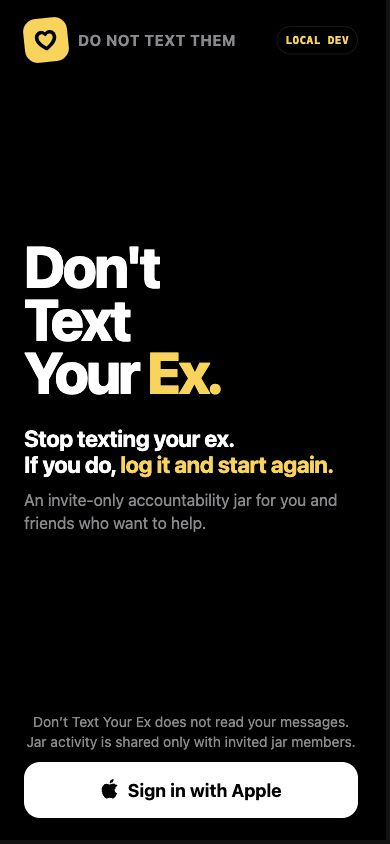
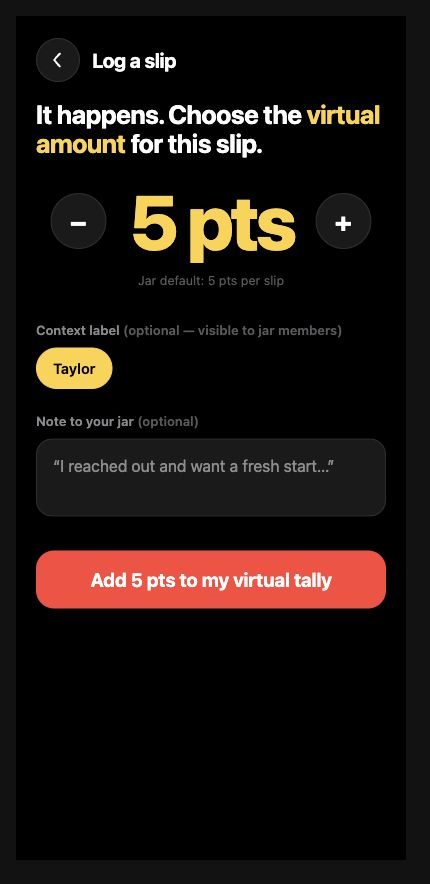
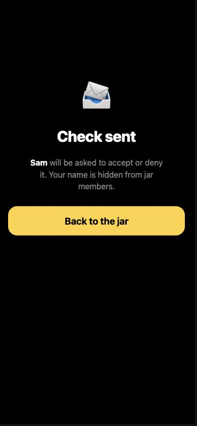
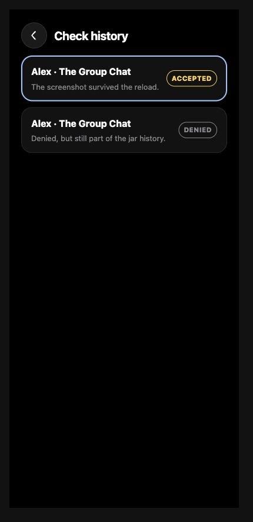
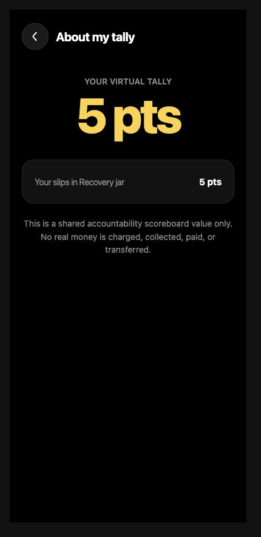
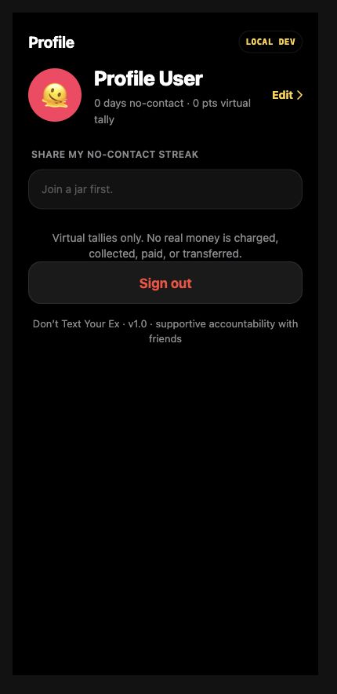

# P02 supportive-positioning evidence

Captured 2026-08-15 PT from branch `codex/dtye-supportive-copy` after commits
`f359e31bb`, `972ec368a`, and `08eba5b7a`. This is dependency-safe implementation evidence;
P02 remains gated by the owner decisions in P01 and therefore earns no release
percentage yet.

## Implemented contract

- Runtime tally values render as virtual points (`N pts`), not dollars.
- Payment-shaped copy and controls are removed. Visible copy states that no real
  money is charged, collected, paid, or transferred.
- Shame, guilt, humiliation, snitching, and accusation framing is replaced with
  private, supportive accountability language.
- Onboarding states that the app does not read messages and that jar activity is
  visible only to invited jar members.
- Gameplay reports are presented as accountability checks. Anonymous checks
  explain the jar-member visibility boundary; moderation/account deletion remain
  separate later release packets.
- Runtime metadata, generated activity copy, README, tests, selectors, and
  Storybook assertions use the same vocabulary.

## Machine verification

| Gate                       | Result                                   |
| -------------------------- | ---------------------------------------- |
| AST runtime-copy policy    | PASS — 12/12                             |
| Frontend Vitest            | PASS — 9 files, 41/41                    |
| Relevant Storybook stories | PASS — 7 files, 54/54                    |
| Frontend TypeScript        | PASS                                     |
| Production frontend build  | PASS                                     |
| Biome tracked-file lint    | PASS                                     |
| Knip                       | PASS (existing configuration hints only) |
| Playwright compile/list    | PASS — 20 tests                          |
| Real-Postgres Playwright   | PASS — 20/20 in 44.8 seconds             |
| `git diff --check`         | PASS                                     |

The Playwright run used a temporary isolated Postgres container and an explicit
test database reset. The container was removed after the run. No production data
or credentials were used.

The copy gate parses runtime TypeScript, TSX, and HTML string literals rather
than relying only on grep. It excludes tests, stories, migrations, and historical
design references; checks prohibited phrase families and sentinel runtime files;
and requires positive message-access and no-money disclosures.

## Rendered proof

These captures contain only deterministic Storybook fixtures, no personal data
or App Store Connect administration details. The changed-screen matrix uses
repo-native Vitest Browser screenshots: each artifact is a complete 984×720
browser-test frame containing the 390×844 Storybook fixture scaled to fit. The
six older targeted captures below are retained as complementary close-ups.

### Changed-screen visual matrix

Every production screen with user-facing copy changed from `origin/main` has a
stable fixture in
[`P02ChangedScreens.stories.tsx`](../../../../apps/dont-text-your-ex/apps/frontend/src/screens/P02ChangedScreens.stories.tsx).
That story artifact has SHA-256
`17557278e2b18604221f8ea7a2516c03416db9b8ea71a37b054eaa3bb9b63519`.
With `VITE_DTYE_P02_CAPTURE=1`, each passing Chromium story writes its named PNG
through the repository's Vitest Browser context. All 14 PNGs below were then
independently inspected at original resolution.

Capture provenance, run from the repository root:

```sh
cd apps/web
VITE_DTYE_P02_CAPTURE=1 bunx vitest run --project storybook ../dont-text-your-ex/apps/frontend/src/screens/P02ChangedScreens.stories.tsx
```

| Changed screen                   | Story export    | 984×720 artifact and SHA-256                                                                                                                | Independent visual result                                                                                              |
| -------------------------------- | --------------- | ------------------------------------------------------------------------------------------------------------------------------------------- | ---------------------------------------------------------------------------------------------------------------------- |
| Auth (`SetupProfile`)            | `Auth`          | [`auth-setup-profile.png`](changed-screens/auth-setup-profile.png) — `2d4b8631c786f7a3c7b04afc6415322baaf2db565bcf4a3918a7fbfe9792d0d0`     | PASS — complete editor and reset CTA; readable, unclipped, fixture-only.                                               |
| Onboarding                       | `Onboarding`    | [`onboarding.png`](changed-screens/onboarding.png) — `07e6dea5bb92f88a41149ff63618cb87970eb945cfb56e2cd0a356bb8043fbec`                     | PASS — supportive reset framing and exact message-access / invited-members disclosure; complete Apple CTA.             |
| Create                           | `CreateJar`     | [`create-jar.png`](changed-screens/create-jar.png) — `3b9a499f078609bae797c098870a20f291b27f503d40f7d3d2909a681a375181`                     | PASS — virtual amount, points, and explicit no-money disclosure; clear disabled empty-form state.                      |
| Home                             | `Home`          | [`home.png`](changed-screens/home.png) — `f7ba83e3860cb71e8c597abdc455924cb8c2a2ba8cfee4218fca88d3232dda14`                                 | PASS — virtual tally, no-contact streak, explicit no-money disclosure, jar and join controls complete.                 |
| Invite                           | `Invite`        | [`invite.png`](changed-screens/invite.png) — `9b65d8232b8879697842757fdeee415e9ef18a9ade96199aaeb9791d72ee8b30`                             | PASS — supportive invitation/choice wording, fixture invite code, expiry, and controls complete.                       |
| Join                             | `Join`          | [`join.png`](changed-screens/join.png) — `18290d701c2102bc97fff775f431cb1d711b92752b9e23de25fccdf3b5add810`                                 | PASS — join choice, virtual amount, and jar-activity/member disclosure readable and unclipped.                         |
| JarDetail                        | `JarDetail`     | [`jar-detail.png`](changed-screens/jar-detail.png) — `2728357491e43dab157d7ce0857a9bf9b1c93fdbcb1afcc9f16683c0d5079352`                     | PASS — points/no-money hero, supportive controls, progress board, and recent activity all complete.                    |
| ActivityTab                      | `Activity`      | [`activity.png`](changed-screens/activity.png) — `e6d817b25bda7b916181a7b4b5ddad326c4bd9067c2f9d6bd7e32d1865deaf79`                         | PASS — check-history and accountability language, supportive feed/caught-up copy, no clipping.                         |
| LogSlip                          | `LogSlip`       | [`log-slip.png`](changed-screens/log-slip.png) — `f5c4d509241d0436ee14622f67c06a0a6bda110074cdd47204200171584b9afa`                         | PASS — supportive form, points, jar-visible context, placeholder, and virtual-tally CTA complete.                      |
| AboutTally (renamed from Settle) | `AboutTally`    | [`about-tally.png`](changed-screens/about-tally.png) — `3022f769f57bdbfe6025053abe5b9e0ab7e38ca603a38754e275e2f98788543e`                   | PASS — virtual tally and exact no-money disclosure readable; complete back control.                                    |
| ReportMember                     | `ReportMember`  | [`accountability-check.png`](changed-screens/accountability-check.png) — `3e2a84c016a4ed019bdefccfb46b88f731e703a4c7a921aed3d68bbcf90ed156` | PASS — accept/deny framing, screenshot-permission warning, and exact name-hiding / safety-retention boundary complete. |
| ConfirmDeny                      | `ConfirmDeny`   | [`confirm-deny.png`](changed-screens/confirm-deny.png) — `0b3b86e933aabb57e35e50827bcb1f4b5a21f48c70e855ac6afdf41e7dd85535`                 | PASS — anonymous sender boundary, supportive check, points, and accept/deny controls complete.                         |
| ReportHistory                    | `ReportHistory` | [`check-history.png`](changed-screens/check-history.png) — `712c1ffbbd06c629e5e9fca1291ea75fe3f95cfdb93d2a95fc4e6cc5f320206b`               | PASS — accepted/denied history is factual, supportive, readable, and unclipped.                                        |
| Profile                          | `Profile`       | [`profile.png`](changed-screens/profile.png) — `905668cb4cc1a4b5fdeb0b42085b58900792620dbdaf34cf36ce8ebac56c97ff`                           | PASS — no-contact/virtual-tally wording, sharing boundary, no-money disclosure, idle sign-out, and footer complete.    |

Changed-screen visual-proof total: **14 independently image-reviewed screens /
14 changed screens; 14 PASS / 0 FAIL**. No capture requires recapture for P02.

### Onboarding privacy and supportive framing



SHA-256: `8ff55257ea7c4641764bb966ad143d59f9ecfae8a39815445193c9bd6c7b867d`

### Slip logging uses virtual points



SHA-256: `fbaa22a7e07400a4cb9bba80fd3eae809513b2c91d25a6b25fd348da0ced1b86`

### Accountability-check confirmation



SHA-256: `8d8f4bb890e99db572f94f721e160e2f30cf7044a5cfbdf0a9cd2e06ed5013ce`

### Check history



SHA-256: `b6adb5169f05b3a9136f9587d6820170715ac2a4f389f25b9f43c467ffa3aa1c`

### Explicit no-money disclosure



SHA-256: `ef0d4718582fb8488e9b42c2197a0754a3cb2b55c1fad431213246029c8e6d35`

### Profile terminology and disclosure



SHA-256: `0521cd58b199978f89e29800132d510f596ea402dfb695379a19b1d20522dc70`

## Independent visual review

An independent reviewer inspected all 14 changed-screen PNGs at original
984×720 resolution: **14 PASS / 0 FAIL**. The six complementary close-ups were
also previously reviewed: **6 PASS / 0 FAIL** — **20 reviewed artifacts total**.
The review covered complete
controls, layout/clipping, text readability, supportive/no-money/privacy copy,
stable idle/form states, accurate filenames, and PII/secrets. No tokens, emails,
phone numbers, account identifiers, or sensitive infrastructure are visible;
Alex, Sam, Taylor, `RESET1`, Recovery jar, and the 2049 expiry are deterministic
fixtures. `LOCAL DEV`, Storybook framing, and unused browser-frame area make
these internal acceptance artifacts, not final App Store marketing assets.

## Proof boundaries

- These are implementation and deterministic rendered-UI proofs, not final App
  Store marketing screenshots. P13 will capture and inspect the final release
  candidate at Apple-required dimensions.
- The app icon and launch artwork are unchanged and remain P13 work.
- P02 does not claim that UGC safety, moderation, legal pages, account deletion,
  physical-device QA, or App Store review is complete.
- Final P02 status and progress depend on P01 decisions, merge-SHA CI, and the
  independent reviews recorded in the release-control ledger.
