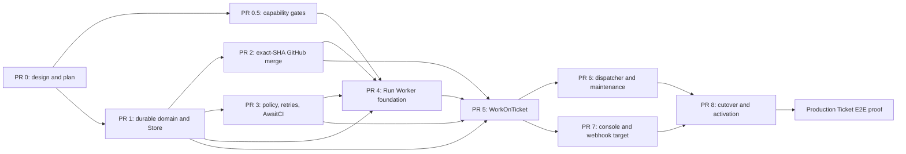

# Software Factory v0 Autonomous Merge Implementation Plan

> **For the manager agent:** Execute this plan from local `wtp` worktrees with
> fresh `gpt-5.6-terra` subagents. Do not send these implementation Tickets
> through the software factory itself. Every code slice is test-first, receives
> a fresh-agent review, and merges without waiting for Calum once its review and
> required checks are green.

**Goal:** A Ticket created through the factory Tickets API is admitted by the
dispatcher, completed by `WorkOnTicket` on one Run Worker generation at a time,
passes SHA-scoped CI and internal review, is squash-merged by the workflow, and
is atomically marked `done` with a Confirmed Merge and complete Step/Agent
Attempt history.

**Done means:** one controlled production Ticket has traversed that exact path
and current evidence proves all of the following:

- the Ticket was created through the Tickets API and became dispatchable;
- the dispatcher started one owning Run under its current policy snapshot;
- repository-affine activities ran through a Run Worker Session;
- CI and a clean internal review authorized the exact merged head SHA;
- GitHub returned `merged: true` with a merge SHA for a squash merge;
- the terminal Store transaction committed the merge, successful Run, Ticket
  `done`, cleared ownership, and unblocked dependency readiness;
- the public API exposes ordered infrastructure Steps, agent-backed Steps,
  Agent Attempts, results, usage state, and transcript identity;
- the old pull-request-closed webhook did not complete the Ticket; and
- no user approval or manual merge action was required.

The design and observable behaviors are authoritative:

- [Run, Step, and Agent Attempt design](../../specs/2026-07-31-software-factory-run-step-attempt-design.md)
- [v0 acceptance-test contract](../../specs/2026-07-31-software-factory-v0-acceptance-test-contract.md)

## Locked execution rules

1. **Local orchestration only.** The manager creates worktrees and delegates
   directly to local subagents. The current software factory must never be
   asked to implement its own replacement.
2. **Terra everywhere.** Every planner, implementer, reviewer, and fixer
   subagent uses `gpt-5.6-terra`. Use fresh context for review roles.
3. **One PR per slice.** Each PR is independently coherent and keeps the
   deployed legacy factory working until the final activation PR.
4. **No legacy workflow version branch.** Do not add `workflow.GetVersion`.
   Add the new workflows and contracts beside the live legacy path, then use
   the explicit quiesce/reconcile cutover before activation.
5. **TDD at public seams.** Start each behavior with a failing test at S1-S8
   from the acceptance contract. Do not test private helper call order.
6. **Mandatory persistence.** A recording failure pauses the workflow at that
   boundary. It never becomes a log-and-continue path.
7. **No user merge loop.** After a fresh Terra review is clean and required CI
   is green, the manager merges the PR. Prefer `gh pr merge --auto --squash`
   where GitHub accepts it. If the repository's human-review rule blocks that
   human-directed PR, use the pre-approved bypass path
   `gh pr merge --admin --squash` after checks are green.
8. **Frequent commits and pushes.** The implementer commits each coherent green
   slice and pushes immediately. Never batch unrelated fixes.
9. **Explicit staging.** Never use `git add -A`; preserve unrelated work.
10. **No final-success shortcut.** Unit tests, fake GitHub, or a local Temporal
    server cannot replace the controlled production Ticket proof.

## PR lifecycle used for every slice

For each PR below, the manager performs this same role cascade:

1. Create a fresh branch from the required merged dependency using
   `wtp add -b <branch> origin/main`.
2. Spawn a fresh Terra implementer with the PR section, design links,
   acceptance IDs, exact worktree path, and a requirement to use TDD.
3. The implementer runs focused tests while working, then the slice's complete
   verify chain, commits, pushes, and opens a regular PR with the repository
   template.
4. Spawn a different fresh Terra reviewer. It reviews the branch against both
   repository standards and the named acceptance scenarios.
5. If findings exist, spawn a Terra fixer or return a narrowly scoped fix task
   to the implementer; push fixes and obtain another fresh review.
6. Wait for every required GitHub check to finish green. Ignore obsolete runs
   from earlier pushes.
7. Merge automatically as described above, confirm the PR is `MERGED`, then
   update dependent branches from the new `origin/main`.

An agent that authored a slice never supplies its only review. Review receipts
must name the commit SHA reviewed so later pushes cannot inherit a stale
approval.

## Standard verification

Every Go slice runs at least:

```sh
cd apps/software-factory
go test -race ./...
golangci-lint run
```

Store slices also run with a real Postgres 18 database through
`SOFTWARE_FACTORY_DATABASE_URL`. Generated-contract slices run:

```sh
cd apps/software-factory
./scripts/regenerate.sh
git diff --exit-code -- internal/store/storedb internal/api/openapi.yaml web/src/api/generated.ts
```

Console slices additionally run:

```sh
cd apps/software-factory/web
bun run test
bun run typecheck
bun run build-storybook
```

Infrastructure slices additionally run the focused Pulumi tests plus root
typecheck. The final integration wave runs the complete repository gates that
CI runs for every affected path.

## Deployment-safety shape

Merging to `main` deploys production, so intermediate PRs must be additive.
The live `FactoryDispatcher` and `FactoryWorkTicket` registrations remain
unchanged until PR 8. Target types may carry a temporary internal `V0` suffix
when coexistence requires it; PR 8 removes legacy types and gives the target
its final names.

Database changes before activation accept both legacy and target records. They
must not map an old `review` Ticket to executable `active` work while the old
dispatcher is live. The final constraint tightening happens only after the
cutover gate proves every old Run is closed and auto-merge has been disabled on
its unmerged PR.



PRs 0.5 and 1 are Wave 1 and may run in parallel. After PR 1 merges, PRs 2 and
3 may run in parallel. PRs 6 and 7 are the final parallel wave before
activation. Every other dependency is serialized deliberately.

## PR 0: design, acceptance contract, and executable plan

**Branch:** `docs/software-factory-step-attempt-design`  
**Existing PR:** #630  
**Produces:** the reviewed design, acceptance scenarios, ubiquitous language,
and this implementation graph.

- [ ] Run a fresh Terra design/code critic against the documents and current
  implementation.
- [ ] Resolve every blocker in the documents, especially explicit Run
  ownership, control-queue bootstrap, main-control finalization, credential
  projection, durable Agent Attempt checkpointing, and no-version cutover.
- [ ] Run a second fresh Terra reviewer against this implementation plan.
- [ ] Push the final documents, wait for PR #630 checks, and merge it.

## PR 0.5: Codex resume and real-Temporal capability gates

**Branch:** `codex/software-factory-v0-capability-gates`  
**Depends on:** PR 0  
**Acceptance:** capability prerequisites for A02/I02-I05/I08
**Produces:** executable evidence, not production behavior.

### Behavior to prove

- [ ] Write a black-box harness against the exact Codex CLI and authentication
  mode installed in the target image. Capture provider thread identity before
  completion, then resume it from a new process on a fresh filesystem.
- [ ] Kill the first process at controlled points before and after provider
  identity becomes durable. Record which cases are resumable, which terminal
  envelope and usage fields survive, and which require a newly authorized
  Agent Attempt.
- [ ] Prove transcript material can be streamed to the Store independently of
  the worker filesystem without exposing credentials.
- [ ] Build the smallest real Temporal harness with a main worker and two
  separately registered private workers. Prove Session affinity, private task
  queue routing, main-worker restart, and permanent Session loss behavior.
- [ ] Export and replay one representative legacy workflow history against the
  unchanged legacy registrations. Preserve it as a regression fixture for the
  later registration changes.
- [ ] Document the exact capability result. If fresh-filesystem Codex resume is
  unavailable, stop before PR 4 and amend A02/I08 explicitly; do not silently
  substitute a different execution model.

This PR is deliberately a gate. It may add hermetic test fixtures and harness
code, but it must not switch production registrations or runtime behavior. It
does not claim the `WorkOnTicket` recovery behavior itself; PRs 4 and 5 remain
responsible for Agent Attempt, Git checkpoint, budget, and workflow recovery.

## PR 1: durable domain and Store foundation

**Branch:** `codex/software-factory-v0-store`  
**Depends on:** PR 0  
**Acceptance:** P01-P13, W01, W09, W11, C02, C04, C07, C08  
**Primary files:**

- `internal/database/migrations/`
- `internal/store/{domain.go,tickets.go,runs.go,steps.go,attempts.go,transcripts.go}`
- `internal/store/queries/*.sql`
- `internal/store/storedb/` generated code
- `internal/store/storefake/`
- `internal/activities/recording.go`
- `internal/work/` target domain types

### Behavior to build

- [ ] Write real-Postgres failing tests for atomic claim-and-Run creation,
  explicit `active_run_id`, stale-owner rejection, idempotent confirmed merge,
  conflicting merge SHA rejection, cancellation, and dependency readiness.
- [ ] Add target Ticket state `active` while retaining legacy `working` and
  `review` compatibility until activation.
- [ ] Add target Run outcome and closed failure-kind types from the design.
- [ ] Make claim and Run creation one transaction. An exact retry returns the
  same ownership; a conflicting Run cannot claim the Ticket.
- [ ] Add ordinal Step and Agent Attempt persistence with lifecycle timestamps,
  kind-specific structured Result, failure kind, provider thread ID, usage
  state, and transcript identity.
- [ ] Add a dual-read compatibility projection for legacy `(stage, turn)`
  Step/Attempt/transcript history and target ordinal history. Do not assume a
  one-time migration can see legacy rows that PRs 1-7 may still create.
- [ ] Add mandatory idempotent start/result APIs. Remove log-and-continue
  semantics from the new recording path.
- [ ] Add one terminal transaction that records reviewed head and immutable
  merge SHA, completes Merge Step and Run, moves only the owned Ticket to
  `done`, clears ownership, and atomically makes dependency readiness visible.
- [ ] Add conditional cancellation and maintenance reconciliation
  transactions. Neither can reopen a `done` Ticket or mutate a later owner.
- [ ] Add a per-Run checkpoint capability hash and Store operations that can
  mutate only that Run's active Agent Attempt and transcript.
- [ ] Add an idempotent durable Git/PR checkpoint containing branch, pushed
  head, observed base, PR number/node ID, and the completed repository-affine
  Step Result. It must reconcile an external GitHub effect whose activity
  response was lost without regressing to an older head.
- [ ] Regenerate sqlc and prove generated artifacts are clean.

The migration stays additive. Constraint removal for `working` and `review`
belongs to PR 8 after production cutover.

## PR 2: exact-SHA squash merge boundary

**Branch:** `codex/software-factory-v0-github-merge`  
**Depends on:** PR 1  
**Acceptance:** G01-G11, F05-F09, F13

**Primary files:**

- `internal/clients/github/`
- `internal/activities/deps.go`
- `internal/activities/activities.go`
- `internal/work/` pull-request and merge-result types

### Behavior to build

- [ ] Write concrete `httptest.Server` tests before client code for squash,
  expected head SHA, authoritative `merged` boolean, and merge SHA parsing.
- [ ] Extend the PR boundary with number, node ID, state, head SHA, base SHA,
  mergeability, and merge SHA. Workflow logic never trusts model prose for
  these values.
- [ ] Add `MergePullRequest` using GitHub REST with
  `merge_method=squash` and expected head SHA.
- [ ] Re-read authoritative merge state after a lost, ambiguous, generic
  405/409/422, or mergeability-computing response before classifying it. Use
  GitHub's merged endpoint or GraphQL `merged` plus `mergeCommit`; a closed PR
  or populated `merge_commit_sha` alone never proves a merge.
- [ ] Return typed domain results for confirmed merge, closed-unmerged,
  textual conflict, head changed, base refresh required, and retryable
  ambiguity. Permission/ruleset and transient/rate-limit failures retain
  Temporal retry classification.
- [ ] Keep `MarkPullRequestReadyForReview` as a separate GraphQL operation but
  add no reviewer request and no auto-merge enablement to the target path.
- [ ] Leave the legacy `EnablePullRequestAutoMerge` method callable until PR 8
  so an intermediate deployment does not break old Runs.

## PR 3: immutable target policy, retry taxonomy, and `AwaitCI`

**Branch:** `codex/software-factory-v0-policy-ci`  
**Depends on:** PR 1  
**Acceptance:** G12

**Capability prerequisites for:** F01-F03, F08-F12, F14, A07-A10

**Primary files:**

- `internal/work/` target Run Policy and Agent Stage types
- `internal/activities/{ci,await_ci}.go`
- `internal/activities/errors.go`
- `internal/clients/github/checks.go`
- focused workflow/activity tests

### Behavior to build

- [ ] Add an immutable target Run Policy without changing policy observed by
  currently open legacy workflows.
- [ ] Put a non-empty explicit required-check set in that immutable policy.
  Reject target Runs whose policy has no required checks.
- [ ] Encode five Review Steps and 25 total workflow-authorized Agent Attempts.
- [ ] Encode agent activity 55-minute Start-To-Close, 90-minute
  Schedule-To-Close, five-minute progress heartbeat, and ten total tries with
  10s exponential backoff, coefficient 2, capped at five minutes.
- [ ] Give CI, merge, provisioning, credential rotation, mandatory recording,
  and teardown named policies rather than generic `StageAttempts` and
  `ControlAttempts`.
- [ ] Reserve semantic deadline versus hard workflow/finalization deadline.
- [ ] Add the target `AwaitCI` activity beside legacy `ObserveCI`: one GitHub
  snapshot per activity try and a retryable expected-wait error carrying a
  15-second `NextRetryDelay`.
- [ ] Query check runs by exact commit SHA and evaluate only the configured
  required set. Unrelated green checks cannot hide an absent, pending, or red
  required check. Retain bounded failure evidence for the next Implement Step.
- [ ] Keep PR 3 accountable for the immutable resolved policy values and their
  validation, the retryable activity error and `NextRetryDelay`, and exact-SHA
  snapshot evaluation including bounded red-check evidence.

PR 3 does not invent the target workflow in order to claim orchestration
coverage early. PR 5 owns scheduling `AwaitCI` with the target
`ActivityOptions`, converting its `ScheduleToClose` timeout into the persisted
`ci_unobserved` Result, and proving that native activity retries consume no
additional Step, Review Step, or Agent Attempt budget.

## PR 4: Run Worker execution, credentials, checkpoints, and real Session proof

**Branch:** `codex/software-factory-v0-run-worker`  
**Depends on:** PRs 0.5, 1, 2, and 3
**Acceptance:** A02, A04-A06, A11-A12, I01-I09, O05, O06  
**Primary files:**

- `cmd/sandbox-worker/` renamed target composition
- `internal/clients/{k8s,local,codex}/`
- `internal/activities/` main-control and Run-Worker dependency sets
- `internal/api/` per-Run checkpoint endpoint
- `images/sandbox/` target Run Worker image and smoke tests
- `infra/src/software-factory.ts`
- `.github/workflows/ci.yml` real-Temporal integration harness

### Behavior to build

- [ ] Rename target vocabulary and image/runtime entry points from Sandbox to
  Run Worker while preserving legacy image compatibility until activation.
- [ ] Provision one worker generation with deterministic Run/generation
  identity, pinned image, private task queue, writable workspace, Codex auth,
  GitHub credential projection, and per-Run checkpoint capability.
- [ ] Mount renewable GitHub credentials as a Secret directory, not `subPath`.
  The main-control rotation activity updates it and returns only revision and
  expiry metadata.
- [ ] Add a Git credential helper and `gh` launcher that read the current token
  for each command. No token appears in argv, Temporal payloads, logs,
  transcript, or the long-lived Codex environment.
- [ ] Move clone to a local Run Worker client and make it the first
  Session-bound activity.
- [ ] Add the narrow authenticated checkpoint API. It stores provider identity
  early and terminal envelope, usage state, and transcript before activity
  success; it cannot finalize or mutate another Run.
- [ ] On retry, reconcile the checkpoint before spawning Codex. Resume the same
  provider thread where supported; otherwise return an unrecoverable result so
  workflow code, not the activity retry, decides whether to authorize another
  Agent Attempt.
- [ ] Reconcile the durable Git/PR checkpoint before repeating clone, push, or
  PR synchronization. Test worker death after GitHub accepted the effect but
  before Temporal received the activity response.
- [ ] Keep the legacy sandbox image, `pods/exec`, remote file transfer, and
  their RBAC rules intact while old workflows can still run. Use a separately
  named Run Worker image/runtime if compatibility requires it; removal belongs
  to PR 8 after quiescence.
- [ ] Add a mandatory real Temporal integration suite with a main worker and
  separately registered private Run Worker. Prove Session affinity,
  filesystem identity, isolation between two workers, main-worker restart,
  worker loss, replacement, and no rerun of completed Steps.

The implementer must verify the actual Temporal Go SDK dev-server/test-server
surface before choosing the harness. If CI needs a Temporal service container,
pin its image and keep the suite hermetic.

## PR 5: `WorkOnTicket` vertical workflow

**Branch:** `codex/software-factory-v0-work-on-ticket`  
**Depends on:** PRs 1-4  
**Acceptance:** W01-W12, F01-F13, A01-A12, C01-C05, C07-C09  
**Primary files:**

- `internal/workflows/work_on_ticket.go`
- target Step/Agent orchestration modules
- workflow tests and real-Postgres workflow integration tests
- prompts and structured handoff types where needed

### Behavior to build

- [ ] Add `WorkOnTicket` beside legacy `FactoryWorkTicket`; do not dispatch it
  in production yet.
- [ ] Claim/start atomically, provision the Run Worker, call `CreateSession`
  immediately, and execute clone as the first repository-affine Step.
- [ ] Wrap each primary operation in one mandatory ordinal Step boundary;
  infrastructure Steps have zero Agent Attempts.
- [ ] Start agent Steps with a durable Agent Attempt before Codex, and record
  the terminal checkpoint before choosing the next Step.
- [ ] Implement plan, implement, exact-SHA CI, fresh review, ready, and
  exact-head squash merge through Confirmed Merge.
- [ ] Schedule `AwaitCI` with the immutable target `ActivityOptions`, convert a
  `ScheduleToClose` timeout into the persisted `ci_unobserved` Result, and
  prove native activity retries create no additional Step and consume neither
  Review Step nor Agent Attempt budget.
- [ ] Resume the implementer thread after CI failure, review findings, textual
  conflict, or base refresh. Every new reviewer is fresh and receives explicit
  structured context.
- [ ] Invalidate CI/review authorization on any head change. Refreshing the
  base produces a new head and repeats both gates without resetting budgets.
- [ ] Enforce five Review Steps and 25 total Agent Attempts cumulatively across
  conflicts, CI feedback, replacement workers, and retries.
- [ ] Recover permanent Session loss with one replacement generation at a
  time. Completed Steps never rerun; unresumable incomplete executions consume
  a newly authorized Agent Attempt only when budget remains.
- [ ] Perform terminal and cancellation recording on main-control contexts.
  Confirmed Merge wins over cancellation. Cleanup cannot reverse success.
- [ ] Return success only after the terminal Store transaction commits.
- [ ] Replay representative target `WorkOnTicket` histories through the final
  workflow registration before this PR is accepted.

## PR 6: dispatcher control queue, retry-driven admission, and maintenance

**Branch:** `codex/software-factory-v0-dispatcher`  
**Depends on:** PR 5  
**Acceptance:** D01-D14, C06  
**Primary files:**

- `internal/workflows/dispatcher.go`
- `internal/workflows/maintain_factory.go`
- `cmd/worker/` startup and registration
- Temporal command client/update code
- maintenance Store/Run-lookup activities

### Behavior to build

- [ ] Add a dispatcher-only control task queue and start its small worker before
  policy publication. Main Run/activity polling starts only after publication
  returns `APPLIED` or `ALREADY_CURRENT`.
- [ ] Use Update-With-Start with `USE_EXISTING`; set Temporal's Update ID to the
  stable request ID. Use the resolved policy fingerprint only for equality,
  not update identity or ordering.
- [ ] Serialize Updates, apply latest arrival for future Runs, and preserve the
  existing policy snapshot of active Runs.
- [ ] Add `AwaitDispatchableTickets` with one Store read per activity try and a
  retryable ten-second no-work delay. Do not schedule it while paused, at
  capacity, or draining.
- [ ] Retain every child Future until completion and make it the sole normal
  slot-release mechanism. Remove target completion signal and `DescribeRun`
  reconciliation.
- [ ] Use explicit `PARENT_CLOSE_POLICY_REQUEST_CANCEL`.
- [ ] On `GetContinueAsNewSuggested`, cancel outstanding admission wait, stop
  admission, retain Update handling within its bound, drain child Futures, and
  continue only from an empty in-flight set. After the bounded number of policy
  changes, reject later changes with typed `DRAINING`; their callers retry
  after rollover. Do not cancel a long-lived child merely to make history.
- [ ] Add scheduled `MaintainFactory`. It reconciles directly terminated Runs,
  owned active Tickets, and orphaned Run Workers using conditional Store
  operations; passive leases are not recovery.
- [ ] Keep all target startup paths inactive until PR 8.
- [ ] Replay representative target dispatcher histories through the final
  registration before this PR is accepted.

## PR 7: target console/webhook surface and deployed cutover tooling

**Branch:** `codex/software-factory-v0-console-webhook`  
**Depends on:** PR 5  
**Acceptance:** O01-O08, W12  
**Primary files:**

- `internal/api/`
- `internal/webhook/`
- `cmd/factoryctl/`
- `images/worker/Dockerfile`
- cutover and GitHub-policy verifier scripts
- generated OpenAPI/Orval artifacts
- `web/src/features/console/`
- `web/src/features/ticket-detail/`
- `web/src/components/StatePill.tsx`
- `docs/runbooks/software-factory-v0-cutover.md`

### Behavior to build

- [ ] Expose `active`, Confirmed Merge, Run outcome/failure, ordered Step
  lifecycle/results, Agent Attempts, usage state, and transcript identity.
- [ ] Derive current phase from the latest active Step, falling back to the
  latest terminal Step. Add no mutable `run.phase` field.
- [ ] Render infrastructure Steps with zero Agent Attempts and distinguish
  semantic Agent Attempts from Temporal retry links.
- [ ] Update transcript routes from legacy stage/turn identity to ordinal Step
  identity while preserving historical reads.
- [ ] Add the target factory webhook handler whose authenticated PR-closed
  events are no-ops for Ticket state. Keep the live legacy handler until
  activation so old `review` Tickets can still complete before cutover.
- [ ] Add and deploy an idempotent `factoryctl cutover` command that inventories
  open legacy workflows and PRs, disables auto-merge on unmerged factory PRs,
  conditionally reopens old nonterminal Tickets, and emits a machine-readable
  readiness result without printing secrets. It runs in-cluster with existing
  worker credentials; the manager never reads secret values locally.
- [ ] Add a local GitHub-policy verifier that proves the App is a permitted
  bypass actor for approval while required checks remain enforced.
- [ ] Write the exact cutover runbook and an inert/dry-run path. Prove the tool
  is available in the deployed worker image before PR 8 is opened for merge.
- [ ] Regenerate and verify OpenAPI/Orval output.
- [ ] Update Storybook stories and tests before component changes.

## PR 8: cutover, GitHub policy verification, and production activation

**Branch:** `codex/software-factory-v0-activate`  
**Depends on:** PRs 6 and 7  
**Acceptance:** O07, O09 and the complete contract  
**Primary files:**

- final worker registrations and target names
- final schema constraint migration
- infra registration/schedule/image wiring
- `apps/software-factory/AGENTS.md`
- `CODEBASE_OVERVIEW.md`
- `docs/system-map.md`

### Code before the operational gate

- [ ] Add tests that fail if activation is attempted while old workflow
  executions or legacy Ticket states remain.
- [ ] Prepare the final registration switch: target workflow is
  `WorkOnTicket`, target singleton dispatcher owns the stable ID on its control
  queue, and `MaintainFactory` has its Temporal Schedule.
- [ ] Remove legacy auto-merge enablement, completion signal/reconcile path,
  old polling loop, old workflow registrations, and factory webhook Ticket
  transition.
- [ ] After quiescence, run the final idempotent backfill of every remaining
  legacy Step/Attempt/transcript row into the ordinal model, verify row counts
  and ordering, then switch API reads to the target projection.
- [ ] Remove the legacy sandbox image registration, `pods/exec`, remote file
  transfer, and their RBAC rules only after the old workflow inventory is
  empty and the final history backfill is verified.
- [ ] Tighten Ticket state constraints to `open`, `active`, `done`, `failed`
  only and remove final legacy compatibility types after the data gate.
- [ ] Update permanent docs and standards to the activated vocabulary.

### Required pre-merge operational gate

The manager performs this locally after PR review and green CI, before enabling
its automatic merge:

1. Pause the legacy dispatcher and prove no new child starts.
2. Run the cutover command in inventory mode and retain its artifact.
3. Disable auto-merge on every old unmerged factory PR.
4. Cancel all cooperative legacy Ticket Runs; terminate any remainder.
5. Terminate the legacy dispatcher.
6. Reconcile all old `working`/`review` Tickets to `open`, preserving failed
   historical Runs and leaving `done` untouched.
7. Prove no pre-redesign workflow is open, no legacy state remains, and no old
   PR is merge-authorized.
8. Apply or verify the GitHub App/ruleset bypass needed for workflow-owned
   squash merge while preserving required checks.
9. Enable merge of PR 8. The push to `main` deploys the new system.
10. Wait for software-factory images, deployment rollout, migrations,
    dispatcher policy publication, and `MaintainFactory` Schedule health.

If any gate fails, do not merge PR 8. Fix the code or external policy on its
branch and repeat the gate; do not reintroduce workflow versioning.

## Production E2E completion proof

This is not another implementation PR. It is the acceptance run that decides
whether the overall goal is complete.

1. Through the authenticated factory UI/API, create one controlled Ticket with
   a unique nonce. Its requested change is a harmless, auditable addition to
   `apps/software-factory/docs/e2e-proof.md`, so it exercises software-factory
   CI and deployment paths without inventing product data.
2. Record the Ticket ID and API creation response.
3. Observe through the public API that the dispatcher claims it once and its
   Ticket becomes `active` with one owning Run.
4. Observe Step history through clone, plan, implement, PR sync, exact-SHA CI,
   review, ready, and merge. Verify infrastructure Steps have no Agent Attempt
   rows and native retries do not create semantic Attempts.
5. Verify the factory-authored PR was squash-merged by the GitHub App with no
   human approval, and capture its reviewed head SHA and merge SHA.
6. Query the Ticket again and prove it is `done`, its Run is `succeeded`, its
   Confirmed Merge matches GitHub, ownership is cleared, and its durable
   history is complete.
7. Capture one authenticated PR-closed webhook delivery for the merged PR,
   record the Ticket state immediately before and after handler processing,
   then redeliver the same delivery. Prove both deliveries made no Ticket
   transition and did not duplicate finalization.
8. Confirm a dependent canary Ticket becomes dispatchable only after the first
   Ticket's terminal transaction, or run the equivalent real-Postgres/API
   assertion if creating a second production change would add no information.
9. Run the cutover/maintenance verifier once more and confirm no orphan Run
   Worker, stale active owner, or unexpected old workflow remains.

Any failure keeps the programme open. File no software-factory Ticket for the
repair: create a local worktree, dispatch a Terra implementer, run the same
review/green/automatic-merge cycle, redeploy, and repeat the production Ticket
from the API. Completion is claimed only after one entire new-system Run passes
end to end.
